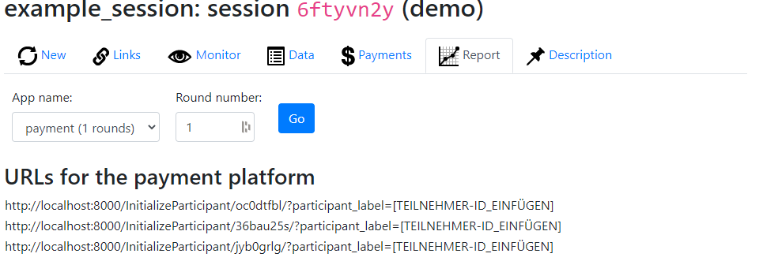
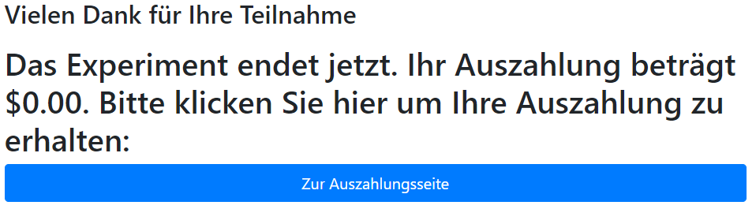

# oTree payment app for the DICE payment platform

This app offers a simple way to connect oTree experiments to the DICE payment platform. 

# Getting started

* Add this repository as a git submodule to your oTree project and name the directory "payment" by running the following commands in your oTree project's root directory.
  ```console
    $ git submodule add <repo_url> payment
    $ git submodule update --init --recursive
  ```
* Add the payment app to the app_sequence in your settings.py
  ```python
    app_sequence = ['some_app_1', 'some_app_2', 'payment']
  ```
* Add the *expId*, *sessId* and *expShortName* entries to your session settings
  * *expId*: Experiment ID (can be found either on the experiment page within Hroot or the payment platform)
  * *sessId*: Session ID (can be found either on the experiment page within Hroot or the payment platform. **IMPORTANT:** This needs to be updated for each session. You can easily do this from the oTree web interface when creating a new session.)
  * *expShortName*: Experiment short name from the payment platform
* Your SESSION_CONFIG should look something like this
   ```python
    SESSION_CONFIGS = [
    dict(
       name='example_session',
       display_name="example_session",
       num_demo_participants=3,
       expShortName="TestExp", # Replace with your values
       expId=0000000000, # Replace with your values
       sessId=0000000000, # Replace with your values
       app_sequence = ['some_app_1', 'some_app_2', 'payment']
    )]  
    ```

# Usage

* Upon creation of a session on the server, move to the *Report* Tab of the payment app and copy the URLs for the payment platform.

* The correct participant label paramater will be automatically added to each URL by the payment platform after you assigned the URLs. 
* If participants use those links passed via the payment platform to join the session, the participant label within oTree will correspond to their Hroot-ID.
* The participant label and the information added to the SESSION_CONFIG will be used to create a participant specific link to the payment platform 
    * Note: Always use the player and participant payoff-field of oTree to store any payments participants receive within your experiment.
* On the last page of the experiment participant will then see their final payoff in the specified real world currency and a button that links to receive their payoff  


# Requirements
* python>=3.10
* otree>5 or otree<5
* Tested with otree==3.3.11 and otree==5.1.1
